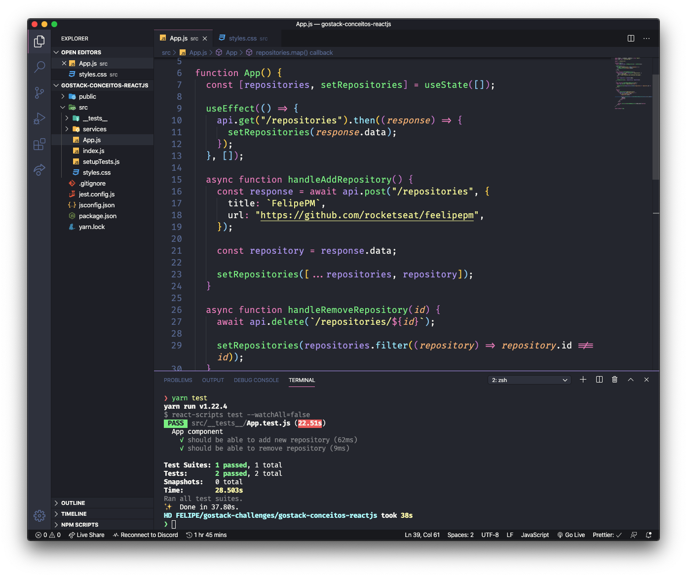
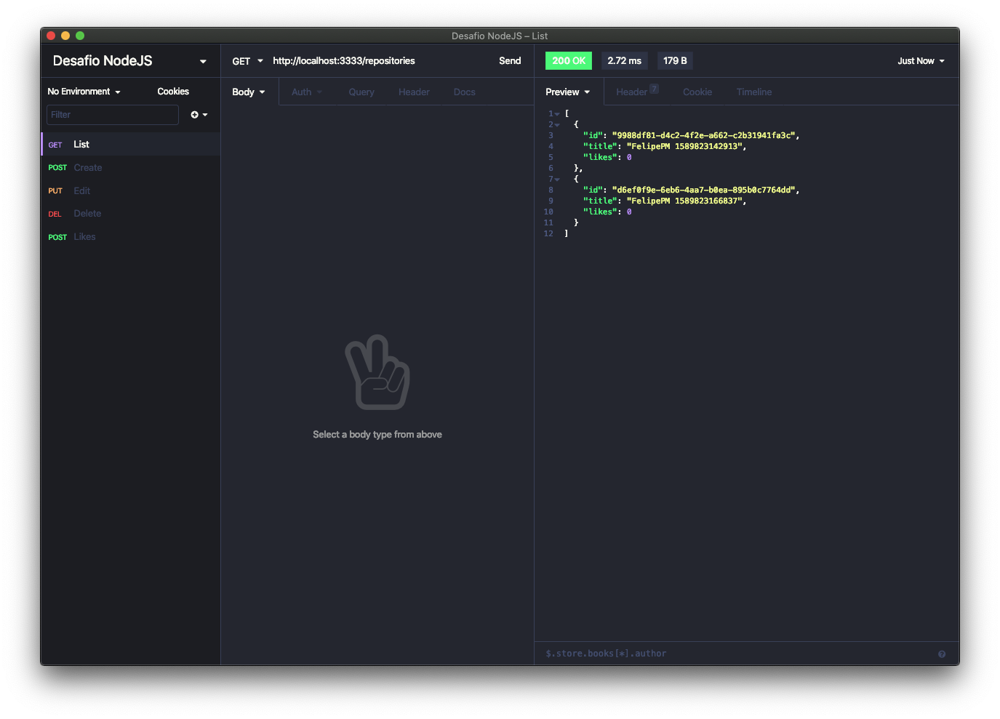

<h3 align="center">
  Desafio: Conceitos de ReactJS
</h3>

“Aprendizado é um processo e você não vai ser um expert em uma semana.” by Diego Fernandes

  <a href="#rocket-sobre-o-desafio">Sobre o desafio</a>&nbsp;&nbsp;&nbsp;|&nbsp;&nbsp;&nbsp;
  <a href="#preview">Preview</a>&nbsp;&nbsp;&nbsp;|&nbsp;&nbsp;&nbsp;
  <a href="#licença">Licença</a>

## Sobre o desafio

A idéia é criar uma aplicação para treinar o que foi estudado até agora com ReactJS!

A aplicação lista os repositórios cadastrados na API feito na aula de [Conceitos de Node.js](https://github.com/FeelipePM/gostack-conceitos-nodejs),

- Através do botão adicionar deve se exibir o nome cadastrado.
- Através do botão remover deve ser removido o item que foi cadastrado tanto na API quanto no nosso front-end.

Acesse a pasta criada e abra no Visual Studio Code, lembre-se de executar o comando `yarn` no seu terminal para instalar todas as dependências.

## Preview

  

  

## Licença

Esse projeto está sob a licença MIT. [LICENSE](LICENSE.md)

---

Feito com ❣️ by [Felipe Machado](https://github.com/FeelipePM)
